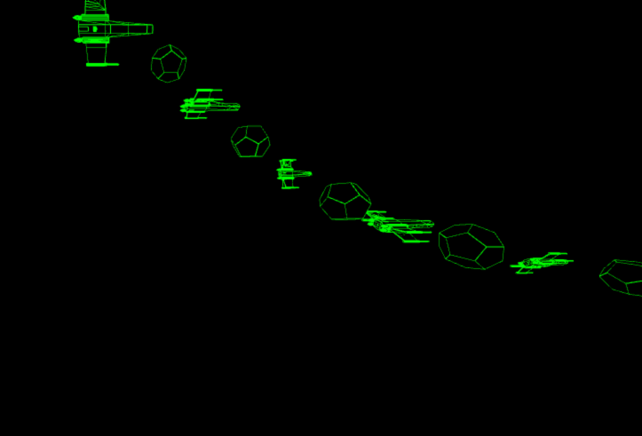

# game-js

A TypeScript/WebGL playground. Currently contains:

- A wireframe renderer using a [custom mesh format](./src/tools/stl2mesh/README.md).
- A [tool](./src/tools/stl2mesh) that converts STL files into the custom mesh format.
- An experiment in entity-component-system game structure.

## Running

First, install dependencies:

    npm install

Run the development server:

    make

Then go to http://localhost:1234.

## Camera controls

- Strafe/translate: W/A/S/D
- Pitch/yaw: arrow keys
- Roll: Q/E

## Tests

To run tests:

    make test
